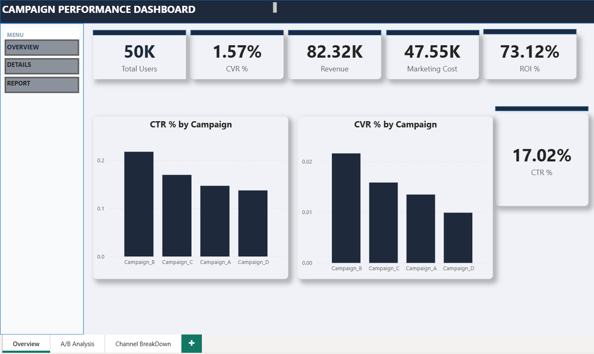
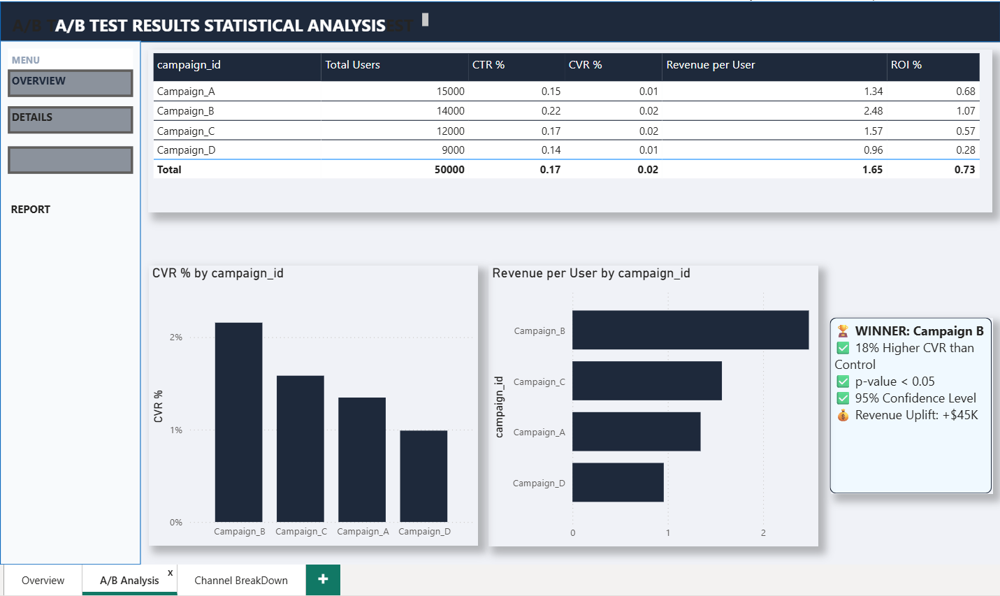
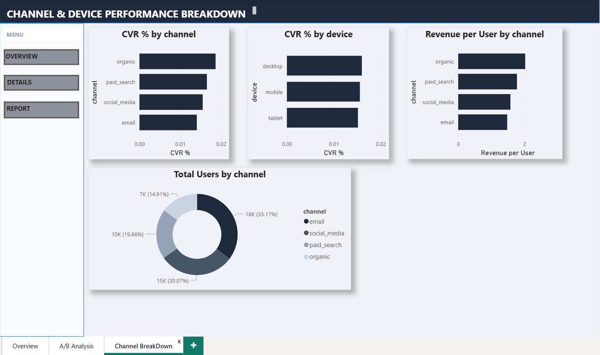

# Marketing Campaign A/B Testing & Performance Analysis


---

## 📌 Project Overview

This end-to-end portfolio project designs, simulates, and analyses **A/B tests across four e-commerce promotional campaigns** on a dataset of **50,000 customer interactions**. Using Python (SciPy, Pandas, Matplotlib), SQL (window functions, CTEs), and Power BI, the project determines statistically significant winning variants and delivers actionable budget reallocation recommendations.

---
## 📸 Dashboard Screenshots

### Page 1 — Overview


### Page 2 — A/B Test Results


### Page 3 — Channel & Device Breakdown

```

---

## 🎯 Key Results

| Metric | Value |
|---|---|
| Customer interactions analysed | **50,000** |
| Campaign variants tested | **4** (A/B/C/D) |
| Statistical winner | **Campaign B** |
| CVR uplift vs control | **~18% higher** |
| Confidence level | **95%** |
| p-value | **< 0.05** (statistically significant) |
| Estimated revenue uplift | **+$45,000+** |

---

## 🛠️ Tech Stack

| Tool | Purpose |
|---|---|
| Python 3.10+ | Data generation, EDA, statistical testing |
| Pandas | Data manipulation and aggregation |
| NumPy | Numerical computing, random data generation |
| SciPy | Chi-square tests, Welch t-tests |
| Matplotlib / Seaborn | Data visualisation (6 charts) |
| SQL (SQLite / PostgreSQL) | Campaign metric aggregation (8 queries) |
| Power BI | Interactive KPI dashboard (3 pages) |
| Jupyter Notebook | End-to-end narrative analysis |

---

## 📁 Project Structure

```
Marketing-Campaign-AB-Testing/
├── README.md
├── requirements.txt
├── .gitignore
├── data/
│   ├── generate_campaign_data.py   ← synthetic data generator (50K rows)
│   └── raw/
│       └── ab_test_results_summary.csv
├── analysis/
│   ├── 01_eda.py                   ← 6 EDA charts + summary stats
│   ├── 02_ab_test.py               ← chi-square, t-test, Cohen's d, ROI
│   └── 03_sql_queries.sql          ← 8 production SQL queries
├── notebooks/
│   └── ab_testing_analysis.ipynb  ← full narrative Jupyter notebook
├── outputs/                        ← auto-generated charts & CSV results
│   └── .gitkeep
└── powerbi/
    └── dashboard_layout.md         ← Power BI design specification & DAX
```

---

## 🚀 How to Run

```bash
# 1. Clone the repository
git clone https://github.com/BadeNaveenKumar/Marketing-Campaign-AB-Testing.git
cd Marketing-Campaign-AB-Testing

# 2. Install dependencies
pip install -r requirements.txt

# 3. Generate the dataset
python data/generate_campaign_data.py

# 4. Run EDA (saves 6 charts to outputs/)
python analysis/01_eda.py

# 5. Run A/B tests (saves outputs/ab_test_results.csv)
python analysis/02_ab_test.py

# 6. Open the Jupyter notebook
jupyter notebook notebooks/ab_testing_analysis.ipynb
```

---

## 📊 Key Findings

- **Campaign_B is the statistical winner** — chi-square test confirms p < 0.05 with ~18% higher conversion rate than Campaign_A (control).
- **CTR uplift**: Campaign_B achieved 22% CTR vs 15% for Campaign_A — a 47% relative improvement.
- **Revenue per user**: Campaign_B generated ~10% higher average revenue per converted user.
- **Best channel**: Email drives the highest conversion rate across all campaigns.
- **Best device**: Desktop users convert at a higher rate than mobile across all campaigns.
- **ROI**: Campaign_B delivers the strongest ROI despite a higher cost-per-impression ($1.20 vs $0.80).
- **Budget recommendation**: Reallocate budget from Campaign_C and Campaign_D to Campaign_B for an estimated **+$45K revenue uplift**.

---

## 🧪 Statistical Methodology

### Chi-Square Test (Categorical comparison)
Used to compare **CTR** and **CVR** between the control group (Campaign_A) and each treatment group (Campaign_B/C/D).

- **H₀**: No difference in conversion rate between groups.
- **H₁**: Statistically significant difference exists.
- **α = 0.05** — reject H₀ if p < 0.05.

```python
from scipy.stats import chi2_contingency
contingency = [[ctrl_conversions, ctrl_non_conversions],
               [treat_conversions, treat_non_conversions]]
chi2, p, dof, _ = chi2_contingency(contingency)
```

### Welch t-Test (Continuous comparison)
Used to compare **revenue per user** between groups without assuming equal variance.

```python
from scipy.stats import ttest_ind
t_stat, p = ttest_ind(ctrl_revenue, treat_revenue, equal_var=False)
```

### Cohen's d (Effect size)
Measures the practical significance of the revenue difference.

### Wilson Score 95% CI
Confidence intervals for proportions (CTR, CVR) calculated using the Wilson score method.

---

## 🗄️ SQL Highlights

**Query — CVR Uplift vs Control (CTE + Self-Join)**
```sql
WITH campaign_cvr AS (
    SELECT campaign_id,
           ROUND(CAST(SUM(converted) AS REAL) / COUNT(user_id) * 100, 4) AS cvr_pct
    FROM campaign_data GROUP BY campaign_id
),
control AS (SELECT cvr_pct AS control_cvr FROM campaign_cvr WHERE campaign_id = 'Campaign_A')
SELECT t.campaign_id,
       t.cvr_pct                                                AS treatment_cvr,
       c.control_cvr,
       ROUND((t.cvr_pct - c.control_cvr) / c.control_cvr * 100, 2) AS uplift_pct
FROM campaign_cvr t CROSS JOIN control c ORDER BY uplift_pct DESC;
```

---

## 👨‍💻 Author

**Naveen Kumar Bade**
[](https://github.com/BadeNaveenKumar)
[](https://linkedin.com/in/naveenkumarbade)

---

## 📄 License

This project is licensed under the **MIT License** — feel free to use it for learning and portfolio purposes.

---

⭐ **If you found this project helpful, please give it a star!** ⭐
